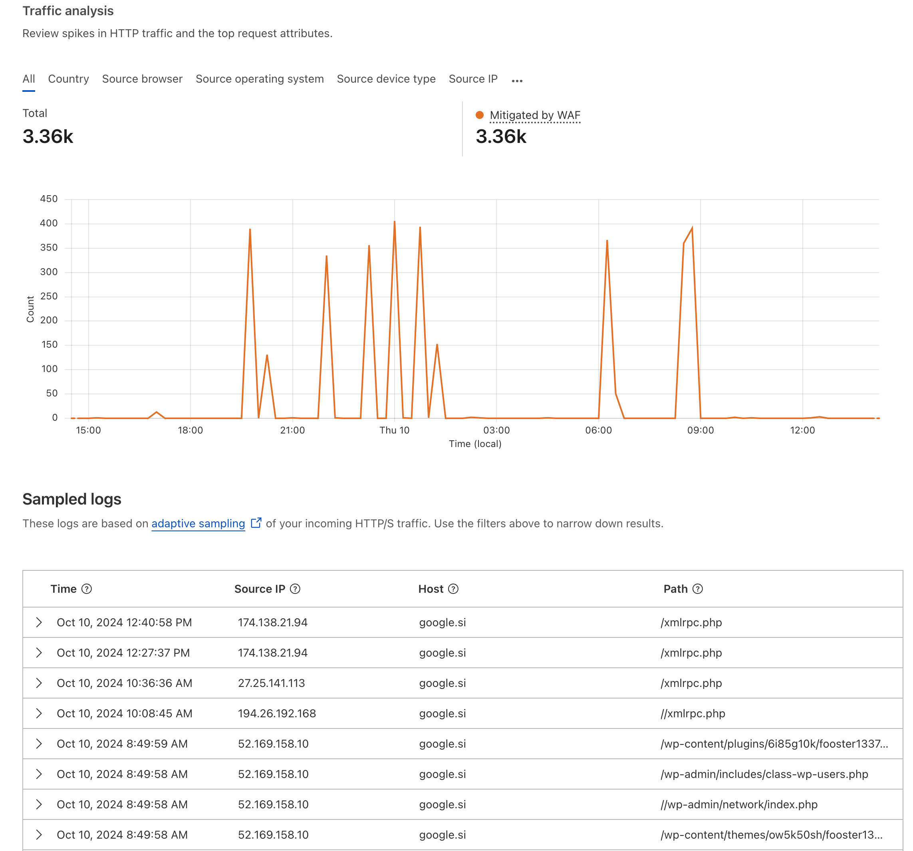

If you’re using Cloudflare to manage your DNS, you should definitely take advantage of their Web Application Firewall (WAF). Why? Because these days, bots and scanners are constantly crawling the web, looking for vulnerable websites, especially WordPress sites. These automated scans can bring your site down if you’re not prepared.

## Why You Need Cloudflare WAF

What many website owners don’t realize is how often their sites are targeted by automated bots. These bots are looking for specific vulnerabilities, usually in WordPress or other popular CMS platforms. Even if your site doesn’t use WordPress, these scans can still affect you by overwhelming your server. Here’s why you should care:

- **High-Volume Bot Traffic**: Automated scanners and bots can send a high number of requests to your site, often in the range of five requests per second. This might not sound like much, but for small websites, these extra requests can strain your server resources, slowing down your site or even causing downtime
- **Unnecessary Load**: Many scanners look specifically for vulnerabilities in WordPress. If your site doesn’t use WordPress, these requests are wasted bandwidth and server capacity, creating additional load for no reason.

## How to Enable Cloudflare WAF

Cloudflare WAF is not enabled by default, so you’ll need to configure it manually. Here’s a simple guide to get it working:

1. **Log into your Cloudflare Dashboard**: Head to [Cloudflare](https://www.cloudflare.com/) and log in with your credentials.
2. **Navigate to the Security Tab**: Once inside the dashboard, go to the “Security” section.
3. **Review Request Activity**: In the Security tab, you’ll see a sample of the requests coming to your site. This will show you a mix of legitimate traffic and potentially harmful requests.
4. **Enable the WAF**: By default, Cloudflare doesn’t block any requests automatically. You’ll need to either:
   - **Turn on Bot Fight Mode**: Cloudflare’s powered bot blocking feature identifies and mitigates bot traffic. This is a great option for a hands-off approach.
   - **Create Custom Rules**: You can manually write firewall rules to block specific types of traffic.

## Writing Custom Firewall Rules

If you notice a lot of requests targeting WordPress vulnerabilities, but you don’t use WordPress, you can create a custom rule to block these attempts. Here’s an example of a rule to block common WordPress scanners:

1. In the **Security** section, click on **Firewall Rules**.
2. Click **Create a Firewall Rule**.
3. Set a condition like:  
   - **Field**: “URI Path”  
   - **Operator**: ends with  
   - **Value**: “.php”
   This will block any request trying to access any PHP file.
4. Save the rule and apply it.

This simple rule will stop any scanner targeting WordPress from overwhelming your server, helping you avoid unnecessary traffic.

## Final Thoughts: Stay Vigilant

In conclusion, enabling Cloudflare’s WAF is an essential step to protecting your site from the constant barrage of automated bot traffic. Even if your site doesn’t use WordPress, these scanners can create significant load and slow down your application. By taking a few minutes to set up the WAF and customize it for your specific needs, you can significantly reduce this unwanted traffic and improve your site’s performance.