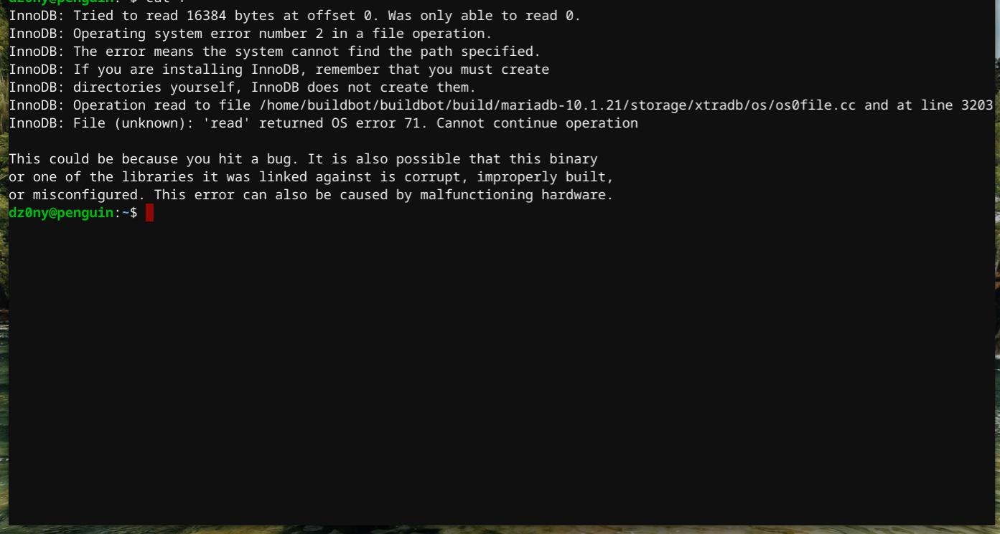

So this all started when one of the production servers started to behave oddly. It would start up work for a while then crash with something like this:

```
InnoDB: Tried to read 16384 bytes at offset 0. Was only able to read 0.
InnoDB: Operating system error number 2 in a file operation.
InnoDB: The error means the system cannot find the path specified.
InnoDB: If you are installing InnoDB, remember that you must create
InnoDB: directories yourself, InnoDB does not create them.
InnoDB: Operation read to file /home/buildbot/buildbot/build/mariadb-10.1.21/storage/xtradb/os/os0file.cc and at line 3203
InnoDB: File (unknown): 'read' returned OS error 71. Cannot continue operation

This could be because you hit a bug. It is also possible that this binary
or one of the libraries it was linked against is corrupt, improperly built,
or misconfigured. This error can also be caused by malfunctioning hardware.
```

If I would only know what file crashed the MySQL, remember it reported ```InnoDB: File (unknown): 'read' returned OS error 71.```

So MySQL is easy to debug right :). First at least in Ubuntu MySQL is ran in wrapper shell script(mysqld_safe). And the script is far from modest one, it wants to be healer, crash detector, process limits changer, starting race protector... a bunch of stuff that should be handled by the process manager.

So after I figure what are default command line parameters for running MySQL. I'll just run it with strace wrapped in nohup. Strace spitting out all system calls and nohup capturing them to file even after I logout. Naturally, I also added a little command to ping me on Slack when it crashes. 

So what I ran was this fancy command:
```nohup strace /usr/sbin/mysqld --basedir=/usr --datadir=/var/lib/mysql --plugin-dir=/usr/lib/mysql/plugin --user=mysql; notify_slack```

Time for coffee... 

Well, this was fast I only just poured milk, 5 minutes later here I was present with this lovely output. 

```
stat("./test_com/wp_posts_sent_to_bli.frm", {st_mode=S_IFREG|0660, st_size=2275, ...}) = 0
stat("./test_com/wp_bn_whitelisted_user_agents_keywords.ibd", {st_mode=S_IFREG|0660, st_size=0, ...}) = 0
open("./test_com/wp_bn_whitelisted_user_agents_keywords.isl", O_RDWR) = -1 ENOENT (No such file or directory)
open("./test_com/wp_bn_whitelisted_user_agents_keywords.ibd", O_RDWR) = 15
fcntl(15, F_SETLK, {type=F_WRLCK, whence=SEEK_SET, start=0, len=0}) = 0
pread(15, "", 16384, 0) = 0
write(2, "2017-03-08 12:32:19 140179095807"..., 1162017-03-08 12:32:19 140179095807936 [ERROR] InnoDB: Tried to read 16384 bytes at offset 0. Was only able to read 0.
) = 116
```

Ok, so this .ibd file seems to be corrupt. Did I mention this mysqld_safe thingy, yes the apparent index file was being written when either process was killed or server was hard rebooted? So let's add one more check into myqld_safe ... just kidding :). Removing .ibd file was enough and running optimize on the table to recreate it. 

Frankly, I'm surprised MySQL does not check this by default, it should be handled in software, not some external script. Now for sake of speediness, I could also have checked for the empty index files in MySQL data directory and this would be solved rather quickly. But you never know what else you can learn from looking bit deeper :)
